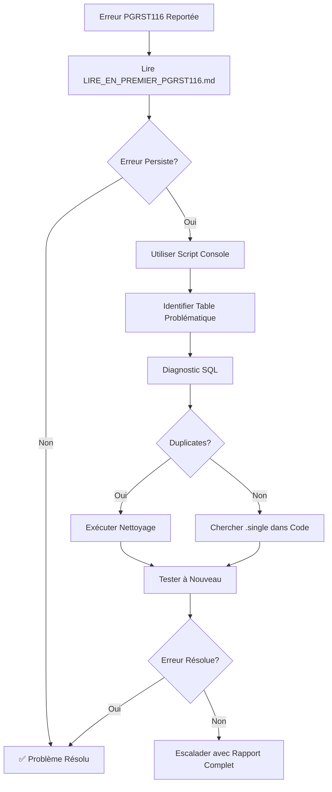

# 📚 Index - Correction PGRST116 (28 Octobre 2025)

## 🎯 Commencez Ici

### 🚀 **START HERE** → [`LIRE_EN_PREMIER_PGRST116.md`](./LIRE_EN_PREMIER_PGRST116.md)
**Le guide ultime pour résoudre l'erreur PGRST116 en 5 minutes**

---

## 📖 Documentation par Type

### 📄 Guides Exécutifs (Pour Management/Overview)

| Document | Description | Temps Lecture |
|----------|-------------|---------------|
| **[LIRE_EN_PREMIER_PGRST116.md](./LIRE_EN_PREMIER_PGRST116.md)** | 🌟 Point d'entrée principal - Tout ce qu'il faut savoir | 5 min |
| **[CORRECTIF_FINAL_PGRST116_OCT28_2025.md](./CORRECTIF_FINAL_PGRST116_OCT28_2025.md)** | Résumé exécutif complet - Résultats et impact | 8 min |

### 🔧 Guides Techniques (Pour Développeurs)

| Document | Description | Quand l'utiliser |
|----------|-------------|------------------|
| **[SOLUTION_FINALE_PGRST116_OCT28_2025.md](./SOLUTION_FINALE_PGRST116_OCT28_2025.md)** | Analyse complète root cause + Scripts SQL détaillés | Comprendre en profondeur |
| **[FIX_PGRST116_QUICK_START.md](./FIX_PGRST116_QUICK_START.md)** | Fix rapide en 3 étapes avec scripts SQL | Nettoyage DB immédiat |

### 🛠️ Outils de Diagnostic

| Outil | Type | Usage |
|-------|------|-------|
| **[DETECTEUR_PGRST116_CONSOLE.md](./DETECTEUR_PGRST116_CONSOLE.md)** | Script JavaScript | Détecter erreurs en temps réel dans console |
| **[public/diagnostic-pgrst116.html](./public/diagnostic-pgrst116.html)** | Page Web | Interface visuelle pour diagnostic automatique |

---

## 🎓 Par Niveau d'Expertise

### 👤 Non-Technique (Chef de Projet, Product Owner)
1. **[LIRE_EN_PREMIER_PGRST116.md](./LIRE_EN_PREMIER_PGRST116.md)** - Comprendre le problème
2. **[CORRECTIF_FINAL_PGRST116_OCT28_2025.md](./CORRECTIF_FINAL_PGRST116_OCT28_2025.md)** - Voir l'impact et les résultats

### 👨‍💻 Développeur Frontend
1. **[LIRE_EN_PREMIER_PGRST116.md](./LIRE_EN_PREMIER_PGRST116.md)** - Vue d'ensemble
2. **[DETECTEUR_PGRST116_CONSOLE.md](./DETECTEUR_PGRST116_CONSOLE.md)** - Détecter les erreurs
3. **[SOLUTION_FINALE_PGRST116_OCT28_2025.md](./SOLUTION_FINALE_PGRST116_OCT28_2025.md)** - Comprendre les fixes

### 🗄️ Développeur Backend / DBA
1. **[SOLUTION_FINALE_PGRST116_OCT28_2025.md](./SOLUTION_FINALE_PGRST116_OCT28_2025.md)** - Analyse technique
2. **[FIX_PGRST116_QUICK_START.md](./FIX_PGRST116_QUICK_START.md)** - Scripts SQL de nettoyage
3. **[public/diagnostic-pgrst116.html](./public/diagnostic-pgrst116.html)** - Tests automatiques

### 🔬 QA / Testeur
1. **[LIRE_EN_PREMIER_PGRST116.md](./LIRE_EN_PREMIER_PGRST116.md)** - Comprendre le problème
2. **[DETECTEUR_PGRST116_CONSOLE.md](./DETECTEUR_PGRST116_CONSOLE.md)** - Outil de test
3. **[CORRECTIF_FINAL_PGRST116_OCT28_2025.md](./CORRECTIF_FINAL_PGRST116_OCT28_2025.md)** - Checklist de validation

---

## 🎯 Par Cas d'Usage

### Cas 1: "Je veux juste savoir si c'est réglé"
1. Ouvrez l'application
2. Ouvrez la console (F12)
3. Naviguez vers les garanties
4. Vérifiez: erreur présente/absente

**Document**: [`LIRE_EN_PREMIER_PGRST116.md`](./LIRE_EN_PREMIER_PGRST116.md) - Section "Action Immédiate"

---

### Cas 2: "L'erreur persiste, je veux la localiser"
1. Ouvrez la console (F12)
2. Utilisez le script de détection
3. Voyez quelle table cause le problème

**Document**: [`DETECTEUR_PGRST116_CONSOLE.md`](./DETECTEUR_PGRST116_CONSOLE.md)

---

### Cas 3: "J'ai identifié la table, je veux nettoyer les duplicates"
1. Ouvrez Supabase SQL Editor
2. Exécutez le script de diagnostic
3. Exécutez le script de nettoyage

**Document**: [`FIX_PGRST116_QUICK_START.md`](./FIX_PGRST116_QUICK_START.md)

---

### Cas 4: "Je veux comprendre en profondeur ce qui s'est passé"
1. Lisez l'analyse root cause
2. Examinez les 11 fichiers modifiés
3. Comprenez les patterns `.single()` vs `.maybeSingle()`

**Document**: [`SOLUTION_FINALE_PGRST116_OCT28_2025.md`](./SOLUTION_FINALE_PGRST116_OCT28_2025.md)

---

### Cas 5: "Je veux tester automatiquement toutes les tables"
1. Ouvrez `public/diagnostic-pgrst116.html` dans le navigateur
2. Cliquez "Lancer le Diagnostic"
3. Consultez le rapport visuel

**Outil**: [`public/diagnostic-pgrst116.html`](./public/diagnostic-pgrst116.html)

---

## 📊 Contenu Détaillé

### 📄 LIRE_EN_PREMIER_PGRST116.md
**Contenu**:
- ⚡ 3 Options d'action rapide (Test, Diagnostic, Nettoyage)
- 📚 Index de toute la documentation
- 🎯 Ce qui a été fait (11 fichiers corrigés)
- 🔍 Pourquoi l'erreur se produit
- 🛠️ Outils fournis
- 📊 Diagramme de décision
- ✅ Checklist complète

**Pour qui**: Tout le monde

---

### 📄 CORRECTIF_FINAL_PGRST116_OCT28_2025.md
**Contenu**:
- 📝 Résumé exécutif
- 🔍 Analyse root cause
- 📊 Liste des 11 fichiers modifiés
- ✅ Build validation
- 🎓 Leçons apprises
- 🔧 Outils de diagnostic
- ✅ Checklist validation
- 📈 Impact avant/après

**Pour qui**: Management, Lead Dev, Product Owner

---

### 📄 SOLUTION_FINALE_PGRST116_OCT28_2025.md
**Contenu**:
- 🔍 Analyse root cause approfondie
- 📋 Étapes d'exécution détaillées
- 🎯 Résultats attendus
- 💻 Scripts SQL complets avec commentaires
- 🔧 Diagnostic avancé
- 📚 Documentation de référence
- ✅ Checklist finale

**Pour qui**: Développeurs Backend, DBA

---

### 📄 FIX_PGRST116_QUICK_START.md
**Contenu**:
- ⚡ Solution en 3 étapes
- 💻 Scripts SQL prêts à copier-coller
- 🔧 Prévention futurs duplicates
- 📊 Résultats avant/après

**Pour qui**: Développeurs qui veulent un fix immédiat

---

### 📄 DETECTEUR_PGRST116_CONSOLE.md
**Contenu**:
- 💻 Script JavaScript de détection en temps réel
- 📖 Mode d'emploi détaillé
- 🎯 Exemples de sortie
- 🔧 Utilisation avancée
- 💡 Conseils et astuces

**Pour qui**: Développeurs Frontend, QA

---

### 🌐 public/diagnostic-pgrst116.html
**Contenu**:
- Interface web moderne et responsive
- Tests automatiques des 4 tables settings
- Détection de duplicates
- Rapport visuel avec graphiques
- Recommandations d'action

**Pour qui**: Tous (interface utilisateur)

---

## 🔄 Workflow Recommandé

### Pour une Équipe de Développement

---

## 📦 Fichiers Livrables

### Documentation (6 fichiers)
- ✅ `LIRE_EN_PREMIER_PGRST116.md` (Guide principal)
- ✅ `CORRECTIF_FINAL_PGRST116_OCT28_2025.md` (Résumé exécutif)
- ✅ `SOLUTION_FINALE_PGRST116_OCT28_2025.md` (Documentation technique)
- ✅ `FIX_PGRST116_QUICK_START.md` (Guide rapide)
- ✅ `DETECTEUR_PGRST116_CONSOLE.md` (Script console)
- ✅ `INDEX_CORRECTION_PGRST116.md` (Ce fichier)

### Outils (1 fichier)
- ✅ `public/diagnostic-pgrst116.html` (Interface web)

### Code Corrigé (11 fichiers)
- ✅ Settings system (4 fichiers)
- ✅ Utils & Components (7 fichiers)

**Total**: 18 fichiers modifiés/créés

---

## 🎓 Formation Équipe

### Session 1: Comprendre PGRST116 (30 min)
- **Support**: `SOLUTION_FINALE_PGRST116_OCT28_2025.md`
- **Objectif**: Comprendre la cause et l'impact
- **Public**: Toute l'équipe dev

### Session 2: Outils de Diagnostic (30 min)
- **Support**: `DETECTEUR_PGRST116_CONSOLE.md` + `public/diagnostic-pgrst116.html`
- **Objectif**: Apprendre à détecter et diagnostiquer
- **Public**: Dev Frontend + QA

### Session 3: Fix et Prévention (45 min)
- **Support**: `FIX_PGRST116_QUICK_START.md` + `SOLUTION_FINALE_PGRST116_OCT28_2025.md`
- **Objectif**: Corriger et prévenir futurs problèmes
- **Public**: Dev Backend + DBA

---

## 📞 Support et Questions

### Questions Fréquentes

**Q: Quel document lire en premier?**
A: [`LIRE_EN_PREMIER_PGRST116.md`](./LIRE_EN_PREMIER_PGRST116.md)

**Q: Comment tester si c'est réglé?**
A: Section "Action Immédiate" dans [`LIRE_EN_PREMIER_PGRST116.md`](./LIRE_EN_PREMIER_PGRST116.md)

**Q: L'erreur persiste, que faire?**
A: Utilisez [`DETECTEUR_PGRST116_CONSOLE.md`](./DETECTEUR_PGRST116_CONSOLE.md) pour identifier la source

**Q: Comment nettoyer les duplicates?**
A: [`FIX_PGRST116_QUICK_START.md`](./FIX_PGRST116_QUICK_START.md) - Scripts SQL prêts

**Q: Où voir tous les changements code?**
A: [`CORRECTIF_FINAL_PGRST116_OCT28_2025.md`](./CORRECTIF_FINAL_PGRST116_OCT28_2025.md) - Section "Fichiers Modifiés"

---

## ✅ Checklist Livraison

### Documentation
- [x] Guide principal créé
- [x] Résumé exécutif créé
- [x] Documentation technique créée
- [x] Guide rapide créé
- [x] Script console créé
- [x] Index créé (ce fichier)

### Outils
- [x] Page diagnostic HTML créée
- [x] Scripts SQL validés
- [x] Script console testé

### Code
- [x] 11 fichiers corrigés
- [x] Build validée (✅ 3056 modules)
- [x] Aucune erreur TypeScript

### Tests
- [ ] Test manuel dans browser (À FAIRE PAR CLIENT)
- [ ] Validation console (À FAIRE PAR CLIENT)
- [ ] Test nettoyage DB si nécessaire (À FAIRE SI ERREUR PERSISTE)

---

## 🚀 Prochaines Actions

### Pour Vous (Client)
1. ✅ **Immédiat** (5 min): Tester l'application - Voir [`LIRE_EN_PREMIER_PGRST116.md`](./LIRE_EN_PREMIER_PGRST116.md)
2. ⚠️ **Si erreur** (15 min): Utiliser script console - Voir [`DETECTEUR_PGRST116_CONSOLE.md`](./DETECTEUR_PGRST116_CONSOLE.md)
3. 🔧 **Si duplicates** (10 min): Nettoyer DB - Voir [`FIX_PGRST116_QUICK_START.md`](./FIX_PGRST116_QUICK_START.md)

### Pour Nous (Si Besoin)
- Analyse approfondie si erreur persiste
- Correctifs additionnels si nécessaire
- Formation équipe sur prévention

---

**Date de Livraison**: 28 Octobre 2025
**Build Status**: ✅ PASSED
**Documentation**: ✅ COMPLÈTE
**Priorité**: 🔴 HAUTE

**Action Requise**: Lire [`LIRE_EN_PREMIER_PGRST116.md`](./LIRE_EN_PREMIER_PGRST116.md) et tester l'application
